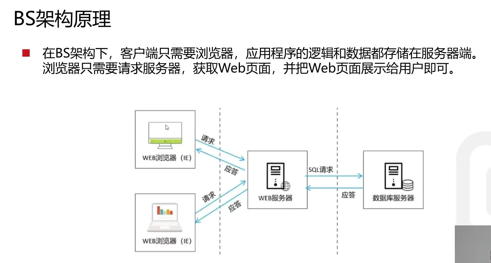
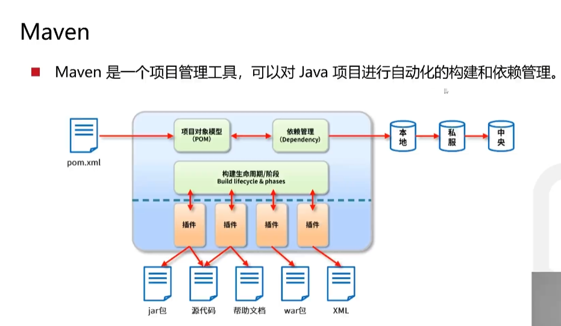
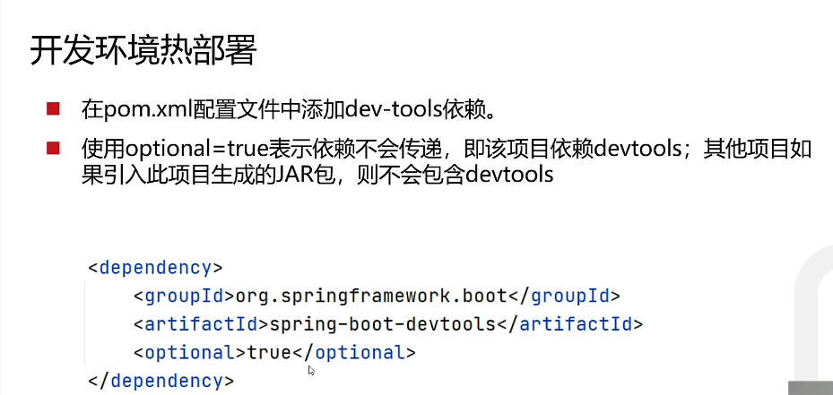
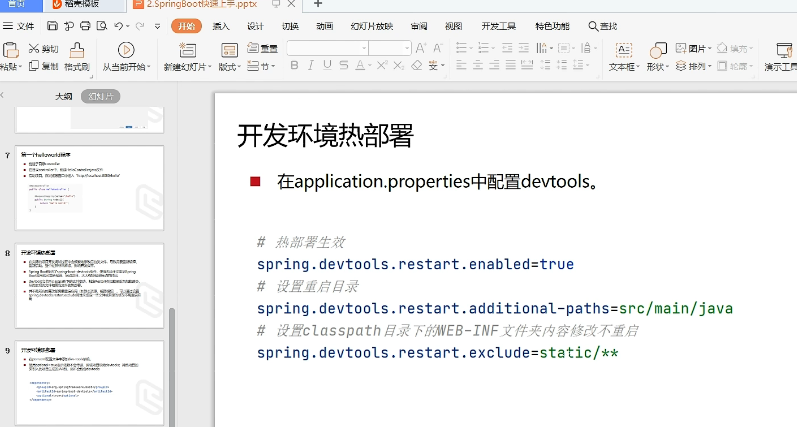
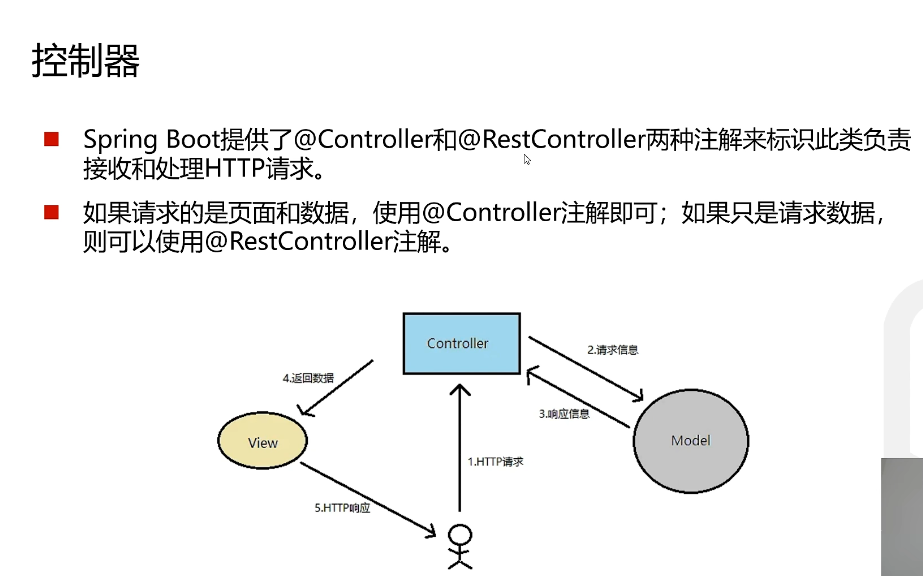
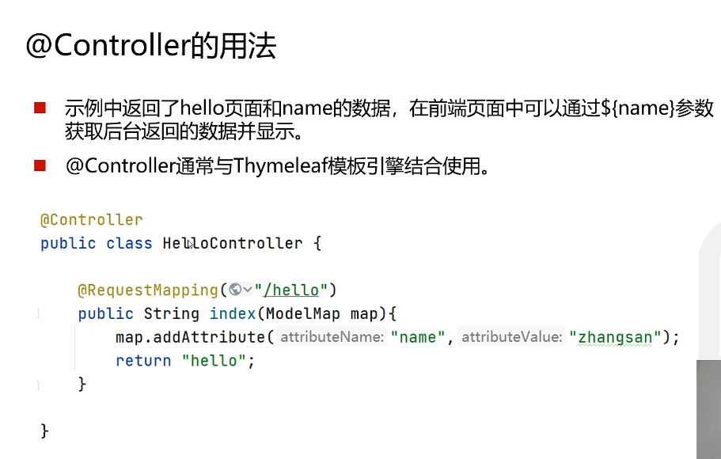
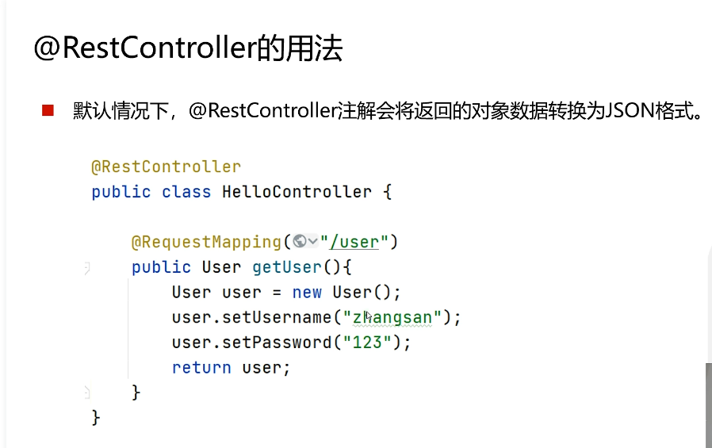
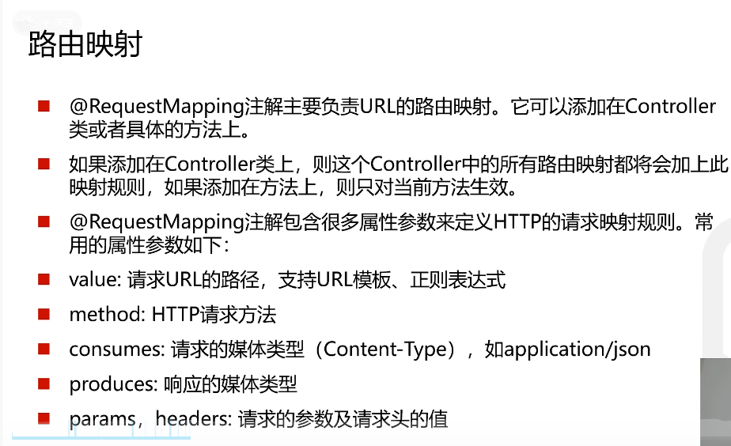
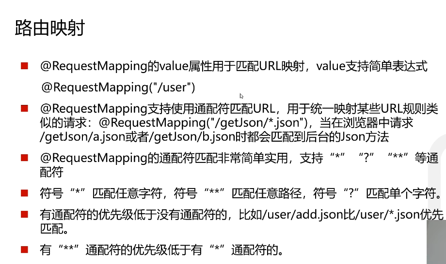

## 架构对比
### B/S (Browser/Server  浏览器/服务器架构模式)
### C/S (Client/Server  客户端/服务器架构模式)

- C/S架构交互性强，有安全访问模式，网络流量低，响应速度快。因为客户端负责大多数业务逻辑和UI演示，所以也被称为胖客户端。C/S的软件需要针对不同的操作系统开发不同版本的软件
 

-  C/S架构不适合Web，最大的原因是Web应用程序的修改和升级非常迅速，而CS需要每个客户端逐个升级桌面App
 

- B/S架构的主要特点是分散性高，维护方便，开发简单，共享性高，总拥有成本低。 

 
 

## MAVEN 
#### Maven的作用
- 项目构建&emsp;&emsp;提供标准的，跨平台的自动化构建项目的方式
 

- 依赖管理&emsp;&emsp;方便快捷的管理项目依赖的资源（jar包），避免资源间的版本冲突等问题

 

- 统一开发结构&emsp;&emsp;提供标准的 统一的项目开发结构
 

 
 

## SpringBoot介绍
Spring Boot 是由 Pivotal 团队提供的全新框架，其设计目的是用来简化新 Spring 应用的初始搭建以及开发过程。该框架使用了特定的方式来进行配置，从而使开发人员不再需要定义样板化的配置。
 

### SpringBoot特点
- 遵循“约定优于配置”原则，只需要很少的配置或使用默认的配置
- 能够使用内嵌的Tomcat，Jetty服务器，不需要部署war文件
- 提供定制化的启动器Starters，简化Maven配置，开箱即用
- 纯Java配置，没有代码生成，也不需要XML配置
- 提供了生产级的服务监控方案，如安全监控，应用监控，健康检测等
 
 

## 开发热部署环境
- SpringBoot提供了spring-boot-detools组件，使得无需手动重启SpringBoot应用即可重新编译，启动项目，大大缩短编译启动的时间
 

- devtools会监听classpath下的文件变动，触发Restart类加载器重新加载该类，从而实现类文件和属性文件的热部署。
 

- 并不是所有的更改都需要重启应用（如静态资源，视图模板），可以通过设置spring.devtools.restart.exclude属性来指定一些文件或目录的修改不用重启应用
 

 
 

 

## Web入门
- SpringBoot将传统开发的mvc,json,tomcat等框架整合，提供了Spring-Boot-starter-web组件，简化了Web应用配置
- Spring-Boot-starter-web启动器主要包括web,webmvc,json,tomcat等基础依赖组件，作用是提供Web开发场景所需的所有底层依赖
- webmvc为Web开发的基础框架,json为JSON数据解析组件,tomcat为自带的容器依赖
 

### 关于控制器
 
- Model：用于存储，封装数据
 

### Controller的用法
 
 

### RestController的用法
 
 

### 路由映射
 
 
 

### 参数传递
- RequestParam将请求参数绑定到控制器的方法参数上，接受的参数来自HTTP请求体或请求URL的QueryString，当请求的参数名称与Controller的业务方法参数名称一致时，@RequestParam可以省略
- PathVariable 用来处理动态的URL，URL的值可以作为控制器中处理方法的参数
- RequestBody接收的参数是来自RequestBody中，即请求体。
 

### 静态资源访问
- 在application.properties中直接定义过滤规则和静态资源位置
- spring.mvc.static-path-pattern=/static/**
- spring.web.resources.static-locations=classpath:/static/
- 过滤规则/static/**
- 静态资源位置classpath:/static/
-  

### 拦截器
- 拦截器在Web系统中非常常见，对于某些全局统一的操作，我们可以把它提取到拦截器中实现。总结起来，拦截器大致有以下几种使用场景：
- 权限检查 如登录检测，进入处理程序检测是否登录，如果没有，则直接返回登录页面
- 性能监控 有时系统在某段时间莫名其妙很慢，可以通过拦截器在进入处理程序之前记录开始时间，在处理完后记录结束时间，从而得到该请求的处理时间
- 通用行为 读取cookie得到用户信息并将用户对象放入请求，从而方便后续流程使用，还有提取Local，Theme信息等，只要是多个处理程序都需要的，即可使用拦截器实现。
-  

#### SpringBoot定义了HandlerInterceptor接口来实现自定义拦截器的功能
#### HandlerInterceptor接口定义了perHandle,postHandle,afterCompletion三种方法，通过重写这三种方法实现请求前，请求后等操作

